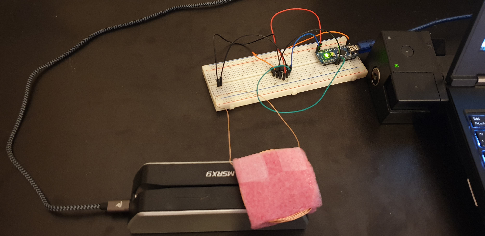
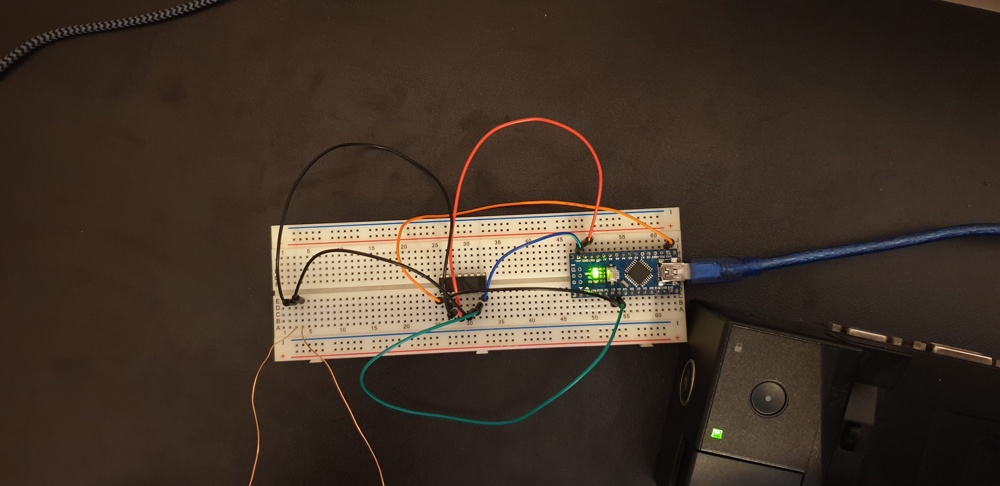

# Magnetic card emulator

### Abstract

This project emulates a magnetic card, wirelessly.

A L293D is used to create a magnetic field and "trick" the reader, as if a card has been swiped.

It is similar to what Samsung calls MST (Magnetic Secure Transmission), and uses for Samsung Pay.

### Prototype

### Software

A basic example can be found in [main.ino](main.ino)

Check [MagSpoof.h](MagSpoof.h) and [MagSpoof.cpp](MagSpoof.cpp) for implementation details.

### Hardware

Here's the hardware *I* used. [Samy Kamkar](https://github.com/samyk/) also gives hardware references in his [repo](https://github.com/samyk/magspoof/).

- Arduino Nano
- [L293D](https://www.amazon.com/gp/product/B00ODQM8KC/)
- [24 AWG Magnet Wire](https://www.amazon.co.uk/gp/product/B07GBQM27Y/)

### Sources and references:

- [samyk/magspoof](https://github.com/samyk/magspoof/) (Original project)
- [miaoski/magspoof](https://github.com/miaoski/magspoof/)
- [joshlf/magspoof](https://github.com/joshlf/magspoof/)
- https://pe2bz.philpem.me.uk/Comm01/-%20Digital/-%20MagneticCards/Info-900-MagCardDecode/magcard.html
